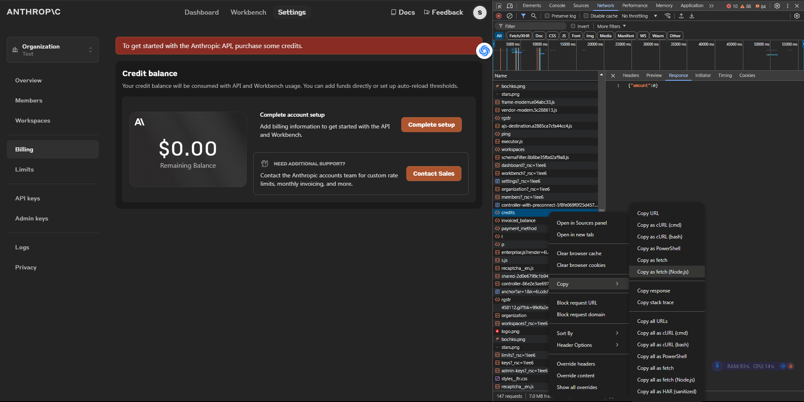
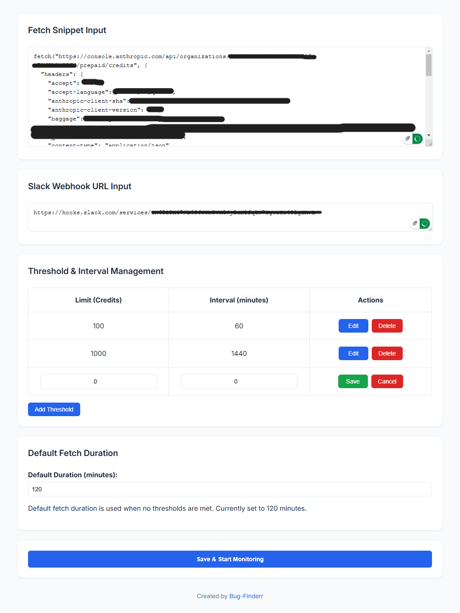
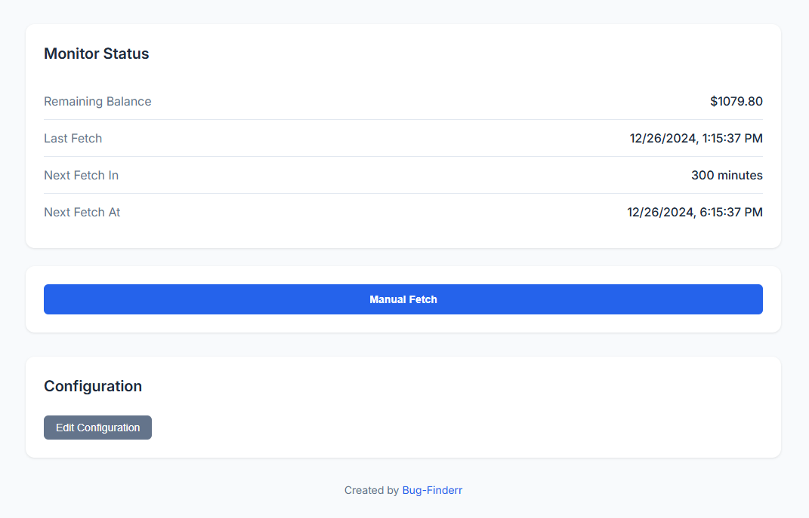

# Anthropic Credit Monitor (Frontend + Backend)


**Version:** 1.0.0  
**Author:** Bug-Finderr  
**License:** MIT

---

## Table of Contents

- [Introduction](#introduction)
- [Features](#features)
- [Prerequisites](#prerequisites)
- [Hosting Instructions](#hosting-instructions)
- [Setup Guide](#setup-guide)
  - [1. Obtain Fetch Snippet](#1-obtain-fetch-snippet)
  - [2. Obtain Slack Webhook](#2-obtain-slack-webhook)
- [Interface Walkthrough](#interface-walkthrough)
  - [1. Setup Page](#1-setup-page)
  - [2. Monitoring Status](#2-monitoring-status)
- [Extension Notice](#extension-notice)
- [Monitoring and Troubleshooting](#monitoring-and-troubleshooting)
- [License](#license)

---

## Introduction

Anthropic Credit Monitor is a tool designed to track API credit balances on the Anthropic platform and send alerts to Slack channels when certain thresholds are met. This solution helps avoid service disruptions by providing timely notifications and updates.

The project consists of two parts:

- **Frontend (React + TypeScript + Vite)**
- **Backend (Node.js + Express + SQLite)**

Both parts must be self-hosted by the user.

---

## Features

- **Real-time Credit Monitoring:** Tracks API credit balance from the Anthropic billing page.
- **Threshold Management:** Configure multiple credit limits and intervals for alerts.
- **Slack Integration:** Sends notifications to specified Slack channels when balance thresholds are reached.
- **Manual and Automatic Fetch:** Manually trigger credit checks or automate them with cron-like scheduling.
- **Fetch Preview:** View current balance, last fetch timestamp, and next fetch schedule.

---

## Prerequisites

- **Node.js:** Version 18 or higher.
- **SQLite3:** Used as a lightweight database for configuration and status storage.
- **Slack Workspace:** To receive notifications.
- **Hosting Environment:** Frontend and backend need to be hosted separately by the user.

---

## Hosting Instructions

1. **Clone the Repository:**

   ```bash
   git clone https://github.com/Bug-Finderr/Anthropic-Credit-Monitor
   cd Anthropic-Credit-Monitor
   ```

2. **Backend Setup:**

   ```bash
   cd backend
   pnpm install
   pnpm start
   ```

3. **Frontend Setup:**

   ```bash
   cd frontend
   pnpm install
   pnpm dev
   ```

4. Access the frontend at `http://localhost:3000` and the backend at `http://localhost:5000`.

_NOTE: Using pnpm cuz I like it, npm and yarn works too._

---

## Setup Guide

### 1. Obtain Fetch Snippet

To fetch the credit balance, you need to get a snippet from the Anthropic billing page.

1. Navigate to the [Anthropic Billing Page](https://console.anthropic.com/settings/billing).
2. Right-click and select **Inspect**.
3. Go to the **Network** tab and refresh the page.
4. Look for a request named `credits`.
5. Right-click the request > **Copy as fetch (Node.js)**.
6. Paste this snippet into the **Fetch Snippet** input field in the frontend.



---

### 2. Obtain Slack Webhook

1. Visit [Slack Incoming Webhooks](https://api.slack.com/messaging/webhooks).
2. Create a new Slack app and enable incoming webhooks.
3. Add a new webhook to the desired channel and copy the generated URL.
4. Paste this URL into the **Slack Webhook** field in the frontend.

---

## Interface Walkthrough

### 1. Setup Page

On the setup page, users can input:

- **Fetch Snippet:** Paste the fetch request to track credits.
- **Slack Webhook:** Paste the slack webhook to receive alerts via Slack.
- **Threshold Management:** Add/edit multiple thresholds for different credit levels and fetch intervals.
- **Default Fetch Interval:** If no thresholds are met, this interval will be used (in minutes).



- **Add Threshold:** Add a row by specifying a credit limit and interval.
- **Edit Threshold:** Modify threshold values directly in the table.
- **Delete Threshold:** Remove unwanted thresholds.

---

### 2. Monitoring Status

Once configured, the monitoring page displays:

- **Remaining Balance:** Shows the latest fetched balance.
- **Last Fetch:** Timestamp of the last fetch.
- **Next Fetch In:** Countdown until the next scheduled fetch.
- **Next Fetch At:** Exact timestamp for the next fetch.

Users can also **trigger a manual fetch** at any time.



---

## Extension Notice

If you need the Chrome Extension version, switch to the `extension` branch.

### Extension Caveats:

- **Browser Dependency:** The extension relies on the browser being active. If the browser is inactive for a long period, the balance may drop significantly past thresholds without triggering alerts.
- **Manual Fetch Required:** The extension must be manually re-triggered if the browser is closed.

⚠️ **Instead, the frontend page as an extension is under development to eliminate this issue.**

---

## Monitoring and Troubleshooting

- If the system does not fetch the balance:

  - Ensure the fetch snippet is correctly copied from the Anthropic billing page.
  - Verify the Slack webhook URL is accurate.
  - Ensure the backend server is running without errors (`npm start`).
  - Check browser developer tools for any errors during fetch operations.

- **Slack Alerts Not Working:**
  - Confirm the Slack app permissions and webhook URL.
  - Ensure the Slack channel exists and the webhook is properly authorized.

---

## License

This project is licensed under the [MIT License](LICENSE).
